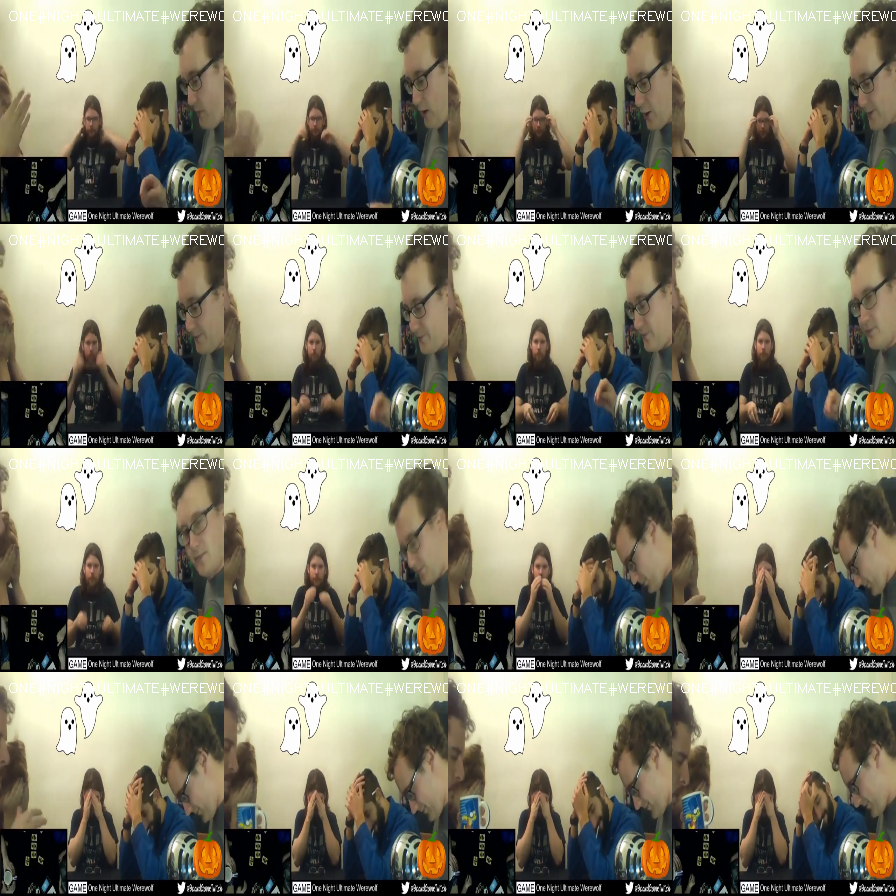
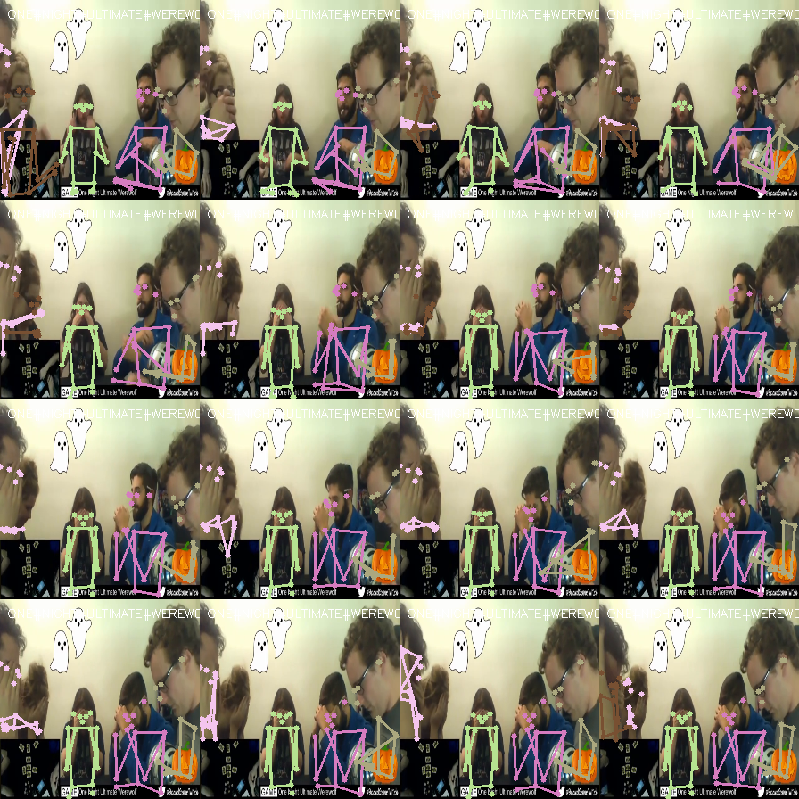
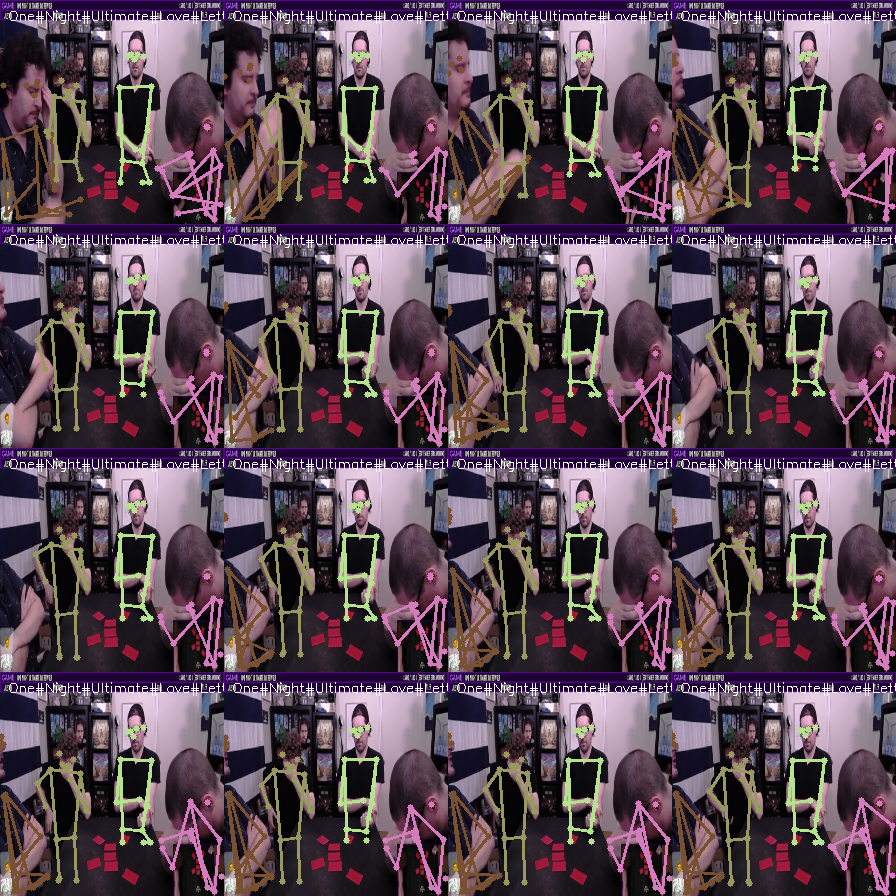

# MMSI Project

Changes in `fixed1.0`:

- Added GPT-2, BART, RoBERTa, BERT, and ELECTRA text encoder support.
- Added architecture-specific text pooling for GPT-2 and BART.
- Added keypoint-video alignment utilities at 5fps.
- Added ViT frame feature extraction and cached ViT training scripts.
- Added a MARLIN wrapper for local integration.

Main files:

- `MMSI/text_encoder.py`
- `MMSI/video_processor.py`
- `MMSI/extract_vit_features.py`
- `MMSI/quick_alignment_preview.py`
- `MMSI/marlin_wrapper.py`
- `run_gpt2_sti_wandb.sh`
- `run_bart_sti_wandb.sh`
- `run_gpt2_sti_cached_vit_quick_wandb.sh`

Alignment check:

- I line up keypoints and video frames on the same 5fps timeline.
- For each utterance, both pose and RGB use the same 16-step window.
- I checked the result by drawing keypoints on the sampled frames.

Examples:

