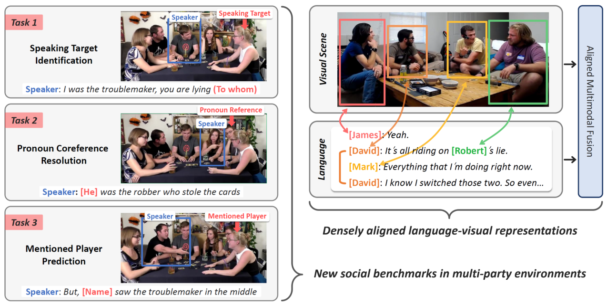
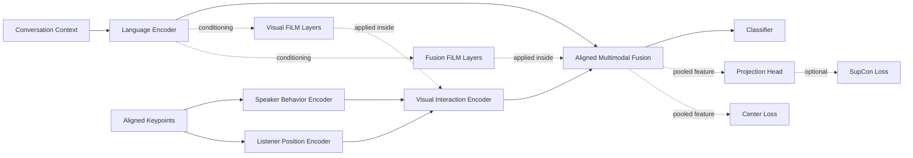

# MMSI Architecture and Experimental Results

STI task on YouTube split  
Project: `MMSI-Project`  
Date: 2026-03-14

---

# Problem Setting

- Goal: improve the MMSI baseline for multimodal social interaction understanding.
- Current experiments focus on `STI` on the YouTube benchmark.
- Inputs:
  - anonymized conversation context
  - aligned player keypoint sequences
  - speaker identity
- Output:
  - target player prediction

---

# Baseline Architecture

Source figure from the official MMSI repository.

---

# Developed Architecture

Current best completed variant:
- `visual_film_layers = 3`
- `fusion_film_layers = 1`
- `center_loss_weight = 0.0`

---

# Implementation Changes

- Added configurable FiLM layers to the Visual Interaction Encoder.
- Added configurable FiLM layers to the Aligned Multimodal Fusion module.
- Added Center Loss sweep support over `(0, 1]`.
- Added projection head and supervised contrastive loss support.
- Added Slurm + W&B experiment runners for reproducible sweeps.

Key files:
- [`ablation_workspace/MMSI/model.py`](/mnt/iusers01/fse-ugpgt01/eee01/t66389xz/MMSI-Project/ablation_workspace/MMSI/model.py)
- [`ablation_workspace/MMSI/train.py`](/mnt/iusers01/fse-ugpgt01/eee01/t66389xz/MMSI-Project/ablation_workspace/MMSI/train.py)
- [`ablation_workspace/run_ablation_sti.sh`](/mnt/iusers01/fse-ugpgt01/eee01/t66389xz/MMSI-Project/ablation_workspace/run_ablation_sti.sh)

---

# Baseline Result

| Model | Task | Dataset | Best Test Acc | Best Epoch |
| --- | --- | --- | ---: | ---: |
| Baseline BERT | STI | YouTube | 0.70382 | 18 |

W&B:
- `baseline_sti_bert_youtube_job12102174`

---

# Visual FiLM Ablation

Fixed setting:
- `fusion_film_layers = 0`
- `center_loss_weight = 0.0`

| Visual FiLM Layers | Best Test Acc | Best Epoch |
| ---: | ---: | ---: |
| 1 | 0.71450 | 86 |
| 2 | 0.71450 | 18 |
| 3 | 0.71756 | 19 |
| 4 | 0.71450 | 17 |

Conclusion:
- Best visual FiLM setting is `3` layers.

---

# Fusion FiLM Ablation

Fixed setting:
- `visual_film_layers = 3`
- `center_loss_weight = 0.0`

| Fusion FiLM Layers | Best Test Acc | Best Epoch |
| ---: | ---: | ---: |
| 1 | 0.72519 | 21 |
| 2 | 0.71145 | 21 |
| 3 | 0.71298 | 193 |
| 4 | 0.72061 | 29 |

Conclusion:
- Best fusion FiLM setting is `1` layer.

---

# Center Loss Ablation

Fixed setting:
- `visual_film_layers = 3`
- `fusion_film_layers = 1`

| Center Loss Weight | Best Test Acc | Best Epoch |
| ---: | ---: | ---: |
| 0.0 | 0.72519 | 21 |
| 0.1 | 0.69313 | 40 |
| 0.2 | 0.65496 | 66 |
| 0.3 | 0.65954 | 25 |
| 0.4 | 0.64885 | 48 |
| 0.5 | 0.64580 | 183 |
| 0.6 | 0.64733 | 117 |
| 0.7 | 0.65802 | 90 |
| 0.8 | 0.64275 | 122 |
| 0.9 | 0.65954 | 114 |
| 1.0 | 0.64885 | 104 |

Conclusion:
- Center Loss did not improve over `0.0`.

---

# Best Completed Model

| Configuration | Best Test Acc | Relative Gain vs Baseline |
| --- | ---: | ---: |
| Baseline | 0.70382 | 0.00000 |
| Best completed FiLM model (`vf3 + ff1`) | 0.72519 | +0.02137 |

Takeaway:
- FiLM helps.
- The largest gain came from adding `3` FiLM layers in the visual interaction encoder and `1` FiLM layer in fusion.
- Center Loss reduced performance across tested settings.

---

# SupCon Integration

Implemented:
- projection head on top of pooled fusion features
- `CE + lambda * SupCon`
- two-view training via stochastic augmentation / dropout-driven dual forward passes

Current sweep:
- `supcon_weight in {0.05, 0.1, 0.2, 0.3}`
- fixed at `vf3 + ff1 + cl0.0`

Status:
- runs are in progress
- final numbers not yet ready for inclusion

---

# Preliminary SupCon Status

Current running jobs:
- `12123282`
- `12123283`
- `12123284`
- `12123285`

Observed intermediate signal:
- one run has already reached `best test acc ~ 0.696` by epoch `16`
- no SupCon run has yet exceeded the completed best FiLM result `0.72519`

Interpretation:
- too early to conclude
- keep running and compare against the `vf3 + ff1 + cl0.0` reference

---

# Gaze and Attention Bottlenecks Review

Gaze360:
- reviewed and not prioritized for immediate integration
- current MMSI pipeline uses keypoints, not raw face/video crops
- integrating gaze would require an additional preprocessing pipeline from original video

Attention Bottlenecks:
- promising for fusion redesign
- better treated as the next architecture experiment after SupCon finishes

---

# Final Conclusions So Far

- Best completed architecture: `visual FiLM = 3`, `fusion FiLM = 1`, `center loss = 0.0`
- Best completed result: `0.72519`
- Improvement over baseline: `+2.14` percentage points absolute
- Center Loss was not beneficial in this setup
- SupCon is implemented and currently under evaluation

---

# Next Steps

1. Finish the SupCon sweep and compare against `0.72519`.
2. If SupCon improves performance, combine `SupCon + best FiLM`.
3. If time permits, replace direct fusion with Attention Bottlenecks.
4. Treat gaze integration as a separate preprocessing project, not a quick architectural swap.
